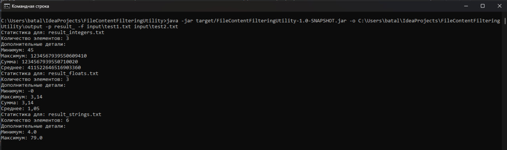
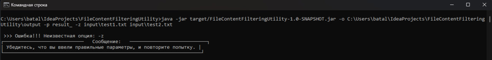
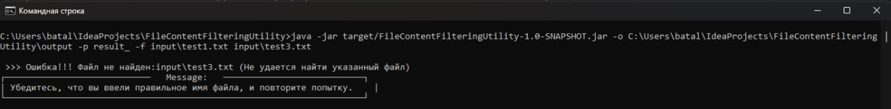
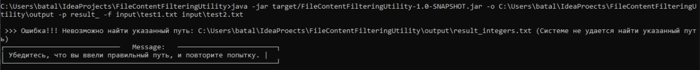

# Утилита фильтрации содержимого файлов.

## Задача
Задача утилиты записать разные типы данных в разные файлы. Целые числа в один
выходной файл, вещественные в другой, строки в третий. По умолчанию файлы с
результатами располагаются в текущей папке с именами integers.txt, floats.txt, strings.txt.
## Описание классов
Все классы находятся в пакете **org.example**.

| Наименование класса/интерфейса | Описание                                                                                                                                                                                                                                                                                                                 |
|--------------------------------|--------------------------------------------------------------------------------------------------------------------------------------------------------------------------------------------------------------------------------------------------------------------------------------------------------------------------|
| Analyst                        | Интерфейс который описывает, что делает аналитик                                                                                                                                                                                                                                                                         |
| NumericAnalyst                 | Реализация интерфейса Analyst, предназначенная для анализа числовых данных из файлов и вывода статистики                                                                                                                                                                                                                 |
| StringAnalyst                  | Реализация интерфейса Analyst. предназначенная для анализа строковых данных из файлов и вывода статистики                                                                                                                                                                                                                |
| FileHandler                    | Интерфейс который описывает, что делать с файлами, например: фильтрация содержимого, удаление пустых файлов и другие проверки.                                                                                                                                                                                           |
| AdditionalOptions              | Сущность которая отвечает за обработку и хранение дополнительных опций, которые передаются программе через аргументы командной строки. Она позволяет настроить такие параметры, как путь к выходным файлам, префикс файлов, режим добавления данных, тип выводимой статистики и список файлов для обработки              |
| FileManager                    | Реализация интерфейса FileHandler, которая выполняет задачи по фильтрации содержимого файлов на основе типов данных. Он также управляет файлами для каждого типа данных, записывая соответствующую информацию в отдельные файлы (целые числа, строки, числа с плавающей точкой), и удаляет пустые файлы после обработки. |
| Main                           | Основной класс приложения с методом main(String[] args)                                                                                                                                                                                                                                                                  |
## Дополнительные опции
| Дополнительные опции | Описание                                                        |
|----------------------|-----------------------------------------------------------------|
| -o                   | Задать путь к результату                                        |
| -p                   | Префикс к названию файла                                        |                  
| -a                   | Добавления в существующие файлы (по умолчанию перезаписываются) |                  
| -s                   | Краткая статистика                                              |                  
| -f                   | Полная статистика                                               |  

Пример: ```-o \somepath\output -p result_ -a -f input\test1.txt input\test2.txt```

## Настройка окружения
Для настройки окружения следует выполнить следующие шаги:

1. Установить дистрибутив Java 17 или выше так, чтобы он запускался по умолчанию. Так же установить maven.
2. Копировать репозиторий в пустой каталог.
    ```bash 
    git clone https://github.com/batalovM/FileContentFilteringUtility.git
    ```

## Запуск приложения
### Запуск приложения, собранного Apache Maven
1. `cd path\FileContentFilteringUtility`
2. `mvn clean package`
3. `java -jar target/FileContentFilteringUtility-1.0-SNAPSHOT.jar -o path\output -p result_ -f input\test1.txt input\test2.txt`

### Пример

```bash
java -jar target/FileContentFilteringUtility-1.0-SNAPSHOT.jar -o C:\Users\batal\IdeaProjects\FileContentFilteringUtility\output -p result_ -f input\test1.txt input\test2.txt
```
## Результат выполнения

## Обработка ошибок
#### Ввод несуществующей опции:

#### Ввод несущего входного файла::

#### Ввод несущего выходного пути:
